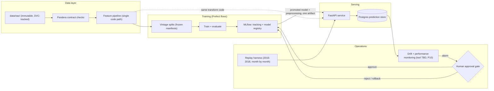

# Architecture

Status: STUB — planned architecture, drawn before implementation. Sections get filled in
as each component lands (P4 onwards); anything not yet built is marked (planned). If the
built system diverges from this page, this page gets corrected — a stale architecture
doc is worse than none.

Tool choices and their rationale: [docs/adr/0001-tool-stack.md](docs/adr/0001-tool-stack.md).

## System overview (planned)

Everything runs locally in Docker Compose; any cloud deploy is a short-lived demo (P8).

## Components

| Component | Tool | Phase | Status |
|---|---|---|---|
| Raw data + versioning | Immutable files, DVC | P1 | (planned) — manifest-by-hash in place |
| Data contract | Pandera | P1 | (planned) |
| Label + leakage ledger | Code + docs | P2 | (planned) |
| Vintage splits | Frozen manifests, hashed | P3 | (planned) |
| Feature pipeline | Single shared code path | P4 | (planned) |
| Experiment tracking + registry | MLflow (local backend) | P5/P7 | (planned) |
| Orchestration | Prefect | P5+ | (planned) |
| Serving API | FastAPI + Uvicorn | P8 | (planned) |
| Prediction store | Postgres (Compose) | P8 | (planned) |
| CI/CD + quality gate | GitHub Actions | P9 | (planned) |
| Replay + drift monitoring | Tool TBD (ADR by P10) | P10 | (planned) |
| HITL retrain approval + rollback | Process + registry stages | P11 | (planned) |

## Load-bearing design rules

1. **One transform path.** Training and serving share the same feature code; parity is
   enforced by a CI test, not by discipline.
2. **Allowlist features.** A column enters the model matrix only if the P2 leakage ledger
   affirmatively classifies it as FEATURE.
3. **Everything traceable.** Any prediction traces to model version → run ID → data hash +
   code commit + split manifest.
4. **No silent promotion.** A model reaches serving only through a recorded human
   approval decision; rollback is a demonstrated path, not an assertion.
