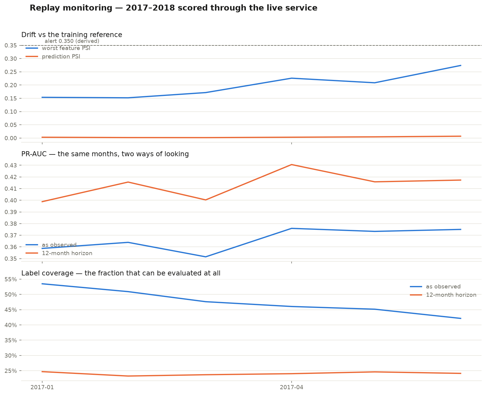

# Monitoring report — replayed 2017–2018

GENERATED by `scripts/monitoring_report.py`. Every number here comes from
predictions the **live service** produced during the replay and stored in
Postgres — not from an offline recomputation.

Predictions analysed: **135,219** across 6 vintage months.

## Alert thresholds, derived rather than adopted

- PSI alert: **0.3498**, KS alert: **0.2687**
- Basis: maximum PSI/KS observed between the training reference and individual training months, scaled by the safety factor — i.e. larger than anything this dataset produced while it was stable
- Quiet months used: 2015-01, 2015-04, 2015-07, 2015-10; worst quiet PSI 0.1749, scaled by 2.0×.

The published 0.1/0.25 PSI bands are conventions. EVAL_PROTOCOL forbids alert
levels copied from a default, so the alarm is set above anything this dataset
produced while it was demonstrably stable.

## Feature and prediction drift

| month   |   loans |   max_psi |   features_alerting | worst_feature    |   prediction_psi |
|:--------|--------:|----------:|--------------------:|:-----------------|-----------------:|
| 2017-01 |   24152 |    0.1537 |                   0 | application_type |           0.0031 |
| 2017-02 |   20453 |    0.1519 |                   0 | application_type |           0.0019 |
| 2017-03 |   27805 |    0.1716 |                   0 | application_type |           0.0017 |
| 2017-04 |   21864 |    0.2259 |                   0 | application_type |           0.0032 |
| 2017-05 |   27456 |    0.2086 |                   0 | application_type |           0.0046 |
| 2017-06 |   13489 |    0.2739 |                   0 | application_type |           0.007  |

## Performance under label lag

Two views of the same months. `as-observed` evaluates every loan resolved by
the data snapshot; `12-month` evaluates only outcomes visible
within 12 months of issue, so each vintage is judged on an equal
window. Where they disagree, the as-observed number is reporting the passage of
time as if it were a change in the model.

### As observed

| issue_month   |   scored |   evaluable |   coverage |   default_rate |   pr_auc |   roc_auc |   mean_predicted |   calibration_gap | horizon_months   |
|:--------------|---------:|------------:|-----------:|---------------:|---------:|----------:|-----------------:|------------------:|:-----------------|
| 2017-01       |    24152 |       12920 |     0.5349 |         0.2022 |   0.3587 |    0.7055 |           0.1499 |           -0.0523 | as-observed      |
| 2017-02       |    20453 |       10415 |     0.5092 |         0.2044 |   0.3639 |    0.6961 |           0.1479 |           -0.0565 | as-observed      |
| 2017-03       |    27805 |       13241 |     0.4762 |         0.1973 |   0.3515 |    0.7014 |           0.146  |           -0.0513 | as-observed      |
| 2017-04       |    21864 |       10069 |     0.4605 |         0.2097 |   0.3759 |    0.7112 |           0.1495 |           -0.0602 | as-observed      |
| 2017-05       |    27456 |       12399 |     0.4516 |         0.2128 |   0.3733 |    0.6975 |           0.1511 |           -0.0617 | as-observed      |
| 2017-06       |    20629 |        8695 |     0.4215 |         0.2102 |   0.375  |    0.7097 |           0.15   |           -0.0602 | as-observed      |

### Fixed 12-month horizon

| issue_month   |   scored |   evaluable |   coverage |   default_rate |   pr_auc |   roc_auc |   mean_predicted |   calibration_gap |   horizon_months |
|:--------------|---------:|------------:|-----------:|---------------:|---------:|----------:|-----------------:|------------------:|-----------------:|
| 2017-01       |    24152 |        5966 |     0.247  |         0.2275 |   0.3988 |    0.7077 |           0.1532 |           -0.0743 |               12 |
| 2017-02       |    20453 |        4757 |     0.2326 |         0.2348 |   0.4156 |    0.7065 |           0.1529 |           -0.0819 |               12 |
| 2017-03       |    27805 |        6587 |     0.2369 |         0.2194 |   0.4003 |    0.7151 |           0.1499 |           -0.0695 |               12 |
| 2017-04       |    21864 |        5253 |     0.2403 |         0.2475 |   0.4306 |    0.7185 |           0.1555 |           -0.092  |               12 |
| 2017-05       |    27456 |        6760 |     0.2462 |         0.2411 |   0.4158 |    0.6981 |           0.154  |           -0.0871 |               12 |
| 2017-06       |    20629 |        4977 |     0.2413 |         0.2425 |   0.4173 |    0.7092 |           0.1561 |           -0.0864 |               12 |

